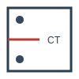

Welcome to Phase-Field Fatigue Suite
====================================

Design and Developed by **Mohammed Maniruzzaman**
Contact: `mmaniruzzaman@alum.wpi.edu <mailto:mmaniruzzaman@alum.wpi.edu>`_

.. toctree::
   :maxdepth: 2
   :caption: Contents:

   introduction
   installation
   usage
   mechanics
   api

Introduction
------------
The Phase-Field Fatigue Suite is a professional 3D fracture mechanics application designed for high-fidelity crack propagation analysis. It integrates advanced multi-physics models, including Hydrogen-Assisted Fracture and stress-assisted diffusion.

Key Features
------------
* **3D Specimen Library**: Support for CT, SENB, and CCT geometries.
* **Variational Solver**: Staggered iterative solver for stable crack growth.
* **Hydrogen Embrittlement**: Fully coupled chemical transport and decohesion models.
* **Batch Processing**: Grid-search parametric studies with automated sensitivity mapping.

License
-------
This project is licensed under the MIT License. See the LICENSE file for details.
